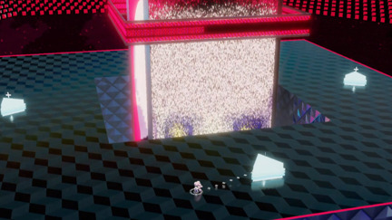
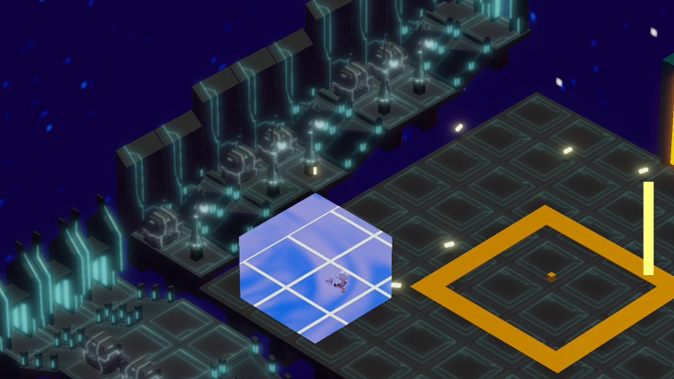

## 「VEIL」

3Dアクションゲームとフレームワーク
* 個人制作
* 開発言語：C++
* ライブラリ：DirectX11, DirectXTex, Assimp, ImGui
* ツール：Visual Studio, Git, Blender, IBLBaker
* 制作時間：約4ヶ月

## プレイ動画
https://github.com/user-attachments/assets/a1f8448a-c97f-4d3c-8f4c-982f3155ba37

## セールスポイント

### シェーダーによる質感表現
* 物理ベースレンダリング
    * イメージベースドライティング
* ポストプロセスエフェクト
    * ブルーム
    * スクリーンスペースリフレクション
* 特殊なシェーダー

#### LCDパネルシェーダー  
メッシュの大きさとテキスチャーの解像度からMipmap Levelを算出し、テキスチャの透明度を自動的に調整することで、モアレの発生を防ぎます
<p>

</p>

#### イメージベースライティング  
抽象的な環境テクスチャを利用することで、反射表現を実現します
<p>

</p>

### 複数のカメラによる演出
自作フレームワークでレンダーテキスチャーを普通のテキスチャーと同じように設定できます
<p>

</p>

### 複数のカメラによる演出
自作フレームワークでレンダーテキスチャーを普通のテキスチャーと同じように設定できます
<p>

</p>

### 多様な反射表現

#### 平面反射
<p>

</p>

反射カメラの行列 `src/render/render_camera.h` `src/math/camear_math.h`
* ビュー行列：平面に対する反射行列を適用した後、メインカメラのビュー行列を適用します。
* プロジェクション行列：平面下のオブジェクトを正しく表示するため、クリッピングを適用します。参考：https://perry.cz/articles/ProjectionMatrix.xhtml

カリング設定 `src/render/render_path.h`
* 平面反射により座標系が反転されるため、RenderPathで各カメラの描画におけるカリング設定を管理します。

#### スクリーンスペースリフレクション(SSR)
<p>

</p>

アルゴリズム `resource/shader/pixel_fullscreen_ssr.hlsl`
* DDA(Digital Differential Analyzer)：スクリーンスペースでレイマーチングを行います。
* 二分探索：ステップごとに一定距離で進み、背後に到達すると、二分探索で交差位置を求めます。長距離では結果が不十分なため、別手法に変更しました。
* 階層化深度バッファ(Hi-Z)：コンピュートシェーダーでZバッファの4ピクセルごとの最小値でミップマップを作成します。レイが最小深度より手前にある場合は、より大きいミップレベルを用いて進行を高速化します。

#### 環境マッピング
<p>

</p>

* キューブマップにレンダリングするカメラに対応しています

### パーティクルエフェクト
<p>

</p>

コンピュートシェーダー用いてパーティクルの初期化および更新を行いました。  
テクスチャを参照してパーティクルの色を設定できるようにしています。  
テクスチャから回転（Curl）を計算し、速度を更新することで、拡散するような表現を実現しました。現在も調整を進めています。

### 効率的な実装
* デファードレンダリング：Depth Pre-Passの導入や、ライトを影響範囲のみで描画するなどにより、さらに効率を向上させました
* メモリ効率の改善：データを連続したメモリに格納し、IDで管理しています
* GPUインスタンシング：自動的にGPUインスタンシングで描画できます
* コンピュートシェーダー：パーティクルやポストプロセスエフェクトで利用しています

### 汎用的なフレームワーク

作成したフレームワークは、チーム制作[https://github.com/tkou2027/at28-dash](https://github.com/tkou2027/at28-dash)でも利用されています。  
拡張性のあるレンダリングパスとカメラシステムにより、シャドウマッピングや、ステンシルバッファを利用した演出を素早く実装できました。

<p>


</p>

## ファイル構成

```
├─resource
│  ├─shader ---- シェーダー
├─src
│  ├─component　---- コンポーネント（描画・当たり判定など機能で利用）
│  ├─config
│  ├─editor　---- AssimpによるUI
│  ├─math
│  ├─object　----　オブジェクトとゲームの実装
│  ├─physics ---- 物理システム（簡易当たり判定）
│  ├─platform
│  ├─render ---- 描画システム
│  │  ├─config ---- ゲーム側でメッシュなどの描画できるものを表現するためのデータ
│  │  ├─particle ---- GPUパーティクルの管理
│  │  ├─pass ---- レンダリングパスで再利用可能な処理ステップ
│  │  ├─path ---- レンダリングパス、カメラ描画に必要な処理手順の管理
│  │  ├─resource ---- 常用GPUリソースとAPIのラッパー
│  │  └─util ---- レンダリングパス
│  ├─scene
│  └─util
```

## 主要な機能とファイル

描画システム `src/render/render_system.h`

カメラシステム `src/render/render_camera.h`

> 複数カメラや複数レンダリングパスに対応した構造を実装しました。
> カメラごとに異なる描画処理や描画対象を設定できるようにしており、環境マップへの描画を行う特殊なカメラにも対応しています。この仕組みにより、例えばシャドウマップ用のカメラ（チーム制作で使用）や平面反射用カメラなど、用途に応じたカメラを拡張しやすい設計にしています。

レンダリングパス `src/render/render_path.h`

> 1回のカメラ描画に必要な処理手順を管理する役割を持ちます。各処理ステップ`src/render/pass/`は再利用できる構造になっており、例えばG Bufferの生成`src/render/pass/geometry/subpass_geometry_default.h`や、クリーンスペースリフレクション(SSR)`src/render/pass/postprocess/pass_ssr.h`などを組み合わせて利用できるようにしました。

## 参考資料

描画
* src/render/util/dx_trace.h、src/render/util/dx_trace.cpp  参考元：GitHub MKXJun/DirectX11-With-Windows-SDK
* src/render/util/gpu_timer.h、src/render/util/gpu_timer.cpp  参考元：GitHub MKXJun/DirectX11-With-Windows-SDK

シェーダー
* resource/shader/feature/shading_pbr.hlsl 参考元：LearnOpenGL
* resource/shader/pixel_blur_dual_up.hlsl、resource/shader/pixel_blur_dual_down.hlsl 参考元：LearnOpenGL
* resource/shader/pixel_forward_screen.hlsl 参考元：GitHub CJT-Jackton/URP-LCD-Dispaly-Example （Mipmap Level計算部分）
* resource/shader/feature/shading.hlhl 参考元：GitHub ashyukiha/GenshinCharacterShaderZhihuVer（RampShadow部分）

その他
* src/math/aabb.h、src/math/aabb.cpp、src/math/interval.h、src/math/interval.cpp 参考元：Ray Tracing in One Weekend
* src/util/debug_ostream.h、src/util/debug_ostream.cpp 授業での配布資料
* src/platform/keyboard.h、src/platform/keyboard.cpp 授業での配布資料
* src/platform/sound.h、src/platform/sound.cpp 授業での配布資料