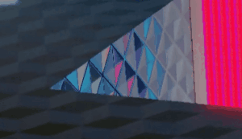
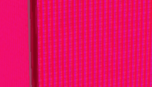
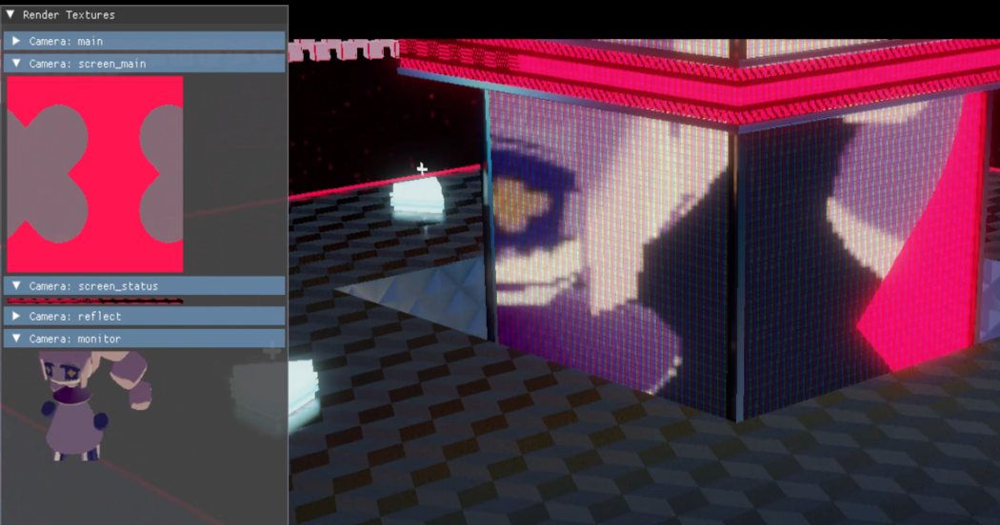
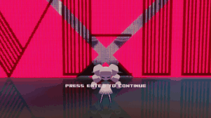
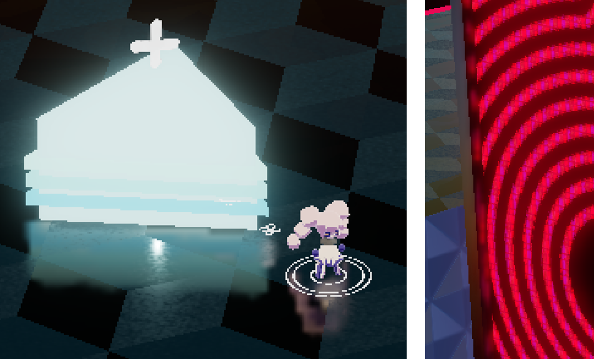
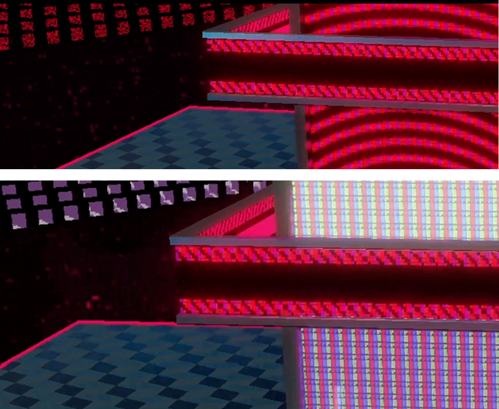

## 「VEIL」

3Dアクションゲームとフレームワーク
* 個人制作
* 開発環境：Visual Studio・C++・DirectX11
* 制作時間：約4ヶ月

## プレイ動画
https://github.com/user-attachments/assets/a1f8448a-c97f-4d3c-8f4c-982f3155ba37

## 主要な機能とファイル

描画システム `src/render/render_system.h`

カメラシステム `src/render/render_camera.h`

> 複数カメラや複数レンダリングパスに対応した構造を実装しました。
> カメラごとに異なる描画処理や描画対象を設定できるようにしており、環境マップへの描画を行う特殊なカメラにも対応しています。この仕組みにより、例えばシャドウマップ用のカメラ（チーム制作で使用）や平面反射用カメラなど、用途に応じたカメラを拡張しやすい設計にしています。

レンダリングパス `src/render/render_path.h`

> 1回のカメラ描画に必要な処理手順を管理する役割を持ちます。各処理ステップ`src/render/pass/`は再利用できる構造になっており、例えばG Bufferの生成`src/render/pass/geometry/subpass_geometry_default.h`や、クリーンスペースリフレクション(SSR)`src/render/pass/postprocess/pass_ssr.h`などを組み合わせて利用できるようにしました。

## セールスポイント

### シェーダーによる質感表現
* 物理ベースレンダリング
* ポストプロセスエフェクト
    * ブルーム
    * スクリーンスペースリフレクション
* 特殊なシェーダー
    * セルシェーダー
    * 自動的に解像度に対応できるLCDパネルシェーダー

### 複数のカメラによる演出
自作フレームワークでレンダーテキスチャーを普通のテキスチャーと同じように設定できます

### 多様な反射表現
* 平面反射
* スクリーンスペースリフレクション
* 環境マッピング

### 効率的な実装
* デファードレンダリング

* GPU インスタンシング

* コンピュートシェーダー

* メモリ効率の改善

  

### 汎用的なフレームワーク

作成したフレームワークは、チーム制作[https://github.com/tkou2027/at28-dash](https://github.com/tkou2027/at28-dash)でも利用されています

